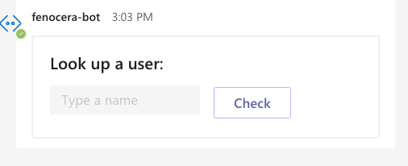

# How to extend

## How to add new templates

To add a new template a developer simply needs to:

1. Create and add the new template json file in `<project>/plugins/templateSelector/templates` directory

1. Add a reference to the template location and corresponding field that will be used to identify the template in the `<project>/plugins/templateSelector/templateConfig.json`

1. Make any necessary updates to code for the template selection logic in the `plugins/templateSelector` plugin (there may be none)

1. If applicable, make any necessary updates to code for the `plugins/preProcessor` and/or `plugins/postProcessor` logic

## Designing Adaptive Cards and Templates

A great resource is the adaptive card designer which can be found [here](https://adaptivecards.io/designer/). This helps to prototype and adjust the various settings/styles and options for adaptive cards before creating the template code for them. The [Schema Explorer](https://adaptivecards.io/explorer/) and [Samples](https://adaptivecards.io/samples/) pages are also excellent resources to help with designing new adaptive card templates.

### Reducing drop-down options when too many are returned

To address the need to reduce the number of items returned and rendered in a drop down can be addressed by creating an additional adaptive card template in the flow that uses an `Input.Text` field type and allows the user to search on a keyword. Based on this input text field, you can add functionality to the bot to handle these search terms sent into the messaging extension `MessagingExtensionQuery`. In this way you can pre-filter and only provide relevant options for the user to choose between.

